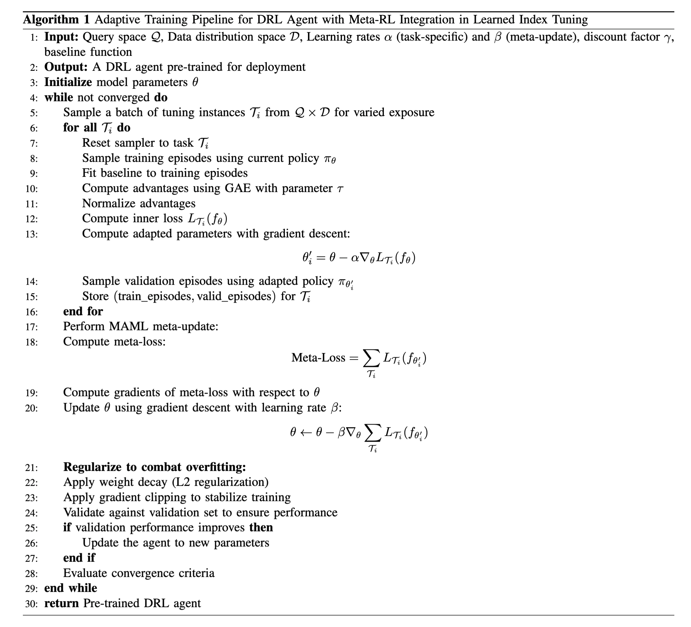

## SOSD data for evaluation

We utilize the State Of the Sorting Database (SOSD) benchmark suite for rigorous evaluation of LITune against learned index structures. This benchmark encompasses datasets with up to 200 million 64-bit unsigned integer keys across various domains: 
- **(a) Amazon data (books)**: Popularity data of book sales.
- **(b) OpenStreetMap data (OSM)**: Identifiers for geographical entities.
- **(c) Facebook data (fb)**: Upsampled dataset of Facebook user IDs.
- **(d) MIX data (MIX)**: A blend of uniform, FB, books, and OSM distributions.


## Workload Details

**Static Workload:**  
In static scenarios, our evaluation dataset consists of 90M records, sampled from a larger 100M dataset. Within this 90M, we allocate 10M records to establish a fixed underlying data distribution, while the remaining 80M are used for updates, specifically for INSERT and DELETE operations. We examine three types of queries: Balanced (B), Read-Heavy (RH), and Write-Heavy (WH). These are characterized by their Write-Read Ratio (W/R Ratio).

**Data-shifting Workload:**  
Evaluations with shifting data adhere to the tumbling window strategy, partitioning the 100M evaluation dataset into 30 distinct data chunks. This technique prompts LITune to frequently adjust its optimization parameters. Due to evaluation cost considerations, we use a scaled-down dataset for this case. Each time window consists of 1M records serving as the underlying data, along with 8M records used for updates (INSERT and DELETE). We maintain the same query types as in the static case.


#### Workload Details Table
| Query Type  | Updates (Static) | Searches (Static) | W/R (Static) | Updates (Data-shifting) | Searches (Data-shifting) | W/R (Data-shifting) |
|-------------|------------------|-------------------|--------------|-------------------------|--------------------------|----------------------|
| Balanced (B) | 160M | 160M | 1 | 16M | 16M | 1 |
| Read-Heavy (RH) | 80M | 240M | 1:3 | 8M | 24M | 1:3 |
| Write-Heavy (WH) | 120M | 40M | 3:1 | 12M | 4M | 3:1 |


## E2E Performance When Limiting the Tuning Budgets

We conducted an analysis on the tuning performance when varying the tuning time budgets, which reflects the considerations for tuning time during online use. Initially, a "Limited Time Budget" examination was carried out, where the tuning process was allotted a timeframe between 50s and 250s. This timeframe is designed to simulate environments where swift decision-making and system adaptability are crucial.

The rationale behind setting this range of tuning budgets is to approximate from 1/5 to the full runtime of ALEX and CARMI for balanced queries with default settings in our tests. This setup is intended to accommodate an evaluation of performance and adaptability amid diverse time-sensitive use-cases. Although specifying tuning steps could be an alternative, the variability in step-wise time requirements across different methods and the real-world user preference for a temporal budget (set in seconds) over a step-wise budget necessitate this approach.

Despite the very limited tuning budgets, LITune still outperforms other tuning methods.

#### Figure: Runtime Performance with Limited Tuning Budget (ALEX)


#### Figure: Runtime Performance with Limited Tuning Budget (CARMI)


## Hyperparameters for Neural Network and Reinforcement Learning Models

| Hyperparameter      | Value    | Description                                            |
|---------------------|----------|--------------------------------------------------------|
| discount            | 0.99     | Discount factor                                        |
| tau                 | 0.005    | Target network update rate                             |
| policy_noise        | 0.2      | Noise added to target policy during critic update      |
| noise_clip          | 0.5      | Range to clip target policy noise                      |
| policy_freq         | 2        | Frequency of delayed policy updates                    |
| actor_lr            | 1e-4     | Learning rate for the actor optimizer                  |
| critic_lr           | 1e-4     | Learning rate for the critic optimizer                 |
| context_hidden_size | [50]     | Hidden size for context module's GRU                   |
| context_output_dim  | 30       | Output dimension for context module's linear layer     |
| actor_hidden_sizes  | [256, 256] | Hidden sizes for actor's linear layers               |
| critic_hidden_sizes | [256, 256] | Hidden sizes for critic's linear layers              |

## Tunable Parameters for Learned Indexes 

You can check details here: [ALEX parameters](./alex_parameters.txt), [CARMI parameters](./carmi_parameters.txt)

## Adaptive Training Pipeline for DRL Agent with Meta-RL Integration in Learned Index Tuning

The following pseudocode outlines an adaptive training pipeline for a Deep Reinforcement Learning (DRL) agent with Meta-Reinforcement Learning (Meta-RL) integration. This pipeline is designed to optimize learned index tuning.

```latex
\begin{algorithm}[ht]
\caption{Adaptive Training Pipeline for DRL Agent with Meta-RL Integration in Learned Index Tuning}
\label{alg:adaptive_training_with_meta_rl}
\begin{algorithmic}[1]
\State \textbf{Input:} Query space $\mathcal{Q}$, Data distribution space $\mathcal{D}$, Learning rates $\alpha$ (task-specific) and $\beta$ (meta-update), discount factor $\gamma$, baseline function
\State \textbf{Output:} A DRL agent pre-trained for deployment
\State \textbf{Initialize} model parameters $\theta$
\While{not converged}
    \State Sample a batch of tuning instances $\mathcal{T}_i$ from $\mathcal{Q} \times \mathcal{D}$ for varied exposure
    \ForAll{$\mathcal{T}_i$}
        \State Reset sampler to task $\mathcal{T}_i$
        \State Sample training episodes using current policy \( \pi_\theta \)
        \State Fit baseline to training episodes
        \State Compute advantages using GAE with parameter $\tau$
        \State Normalize advantages
        \State Compute inner loss \( L_{\mathcal{T}_i}(f_\theta) \)
        \State Compute adapted parameters with gradient descent: 
        \[
        \theta_i' = \theta - \alpha \nabla_{\theta} L_{\mathcal{T}_i}(f_\theta)
        \]
        \State Sample validation episodes using adapted policy \( \pi_{\theta_i'} \)
        \State Store \((\text{train\_episodes}, \text{valid\_episodes})\) for $\mathcal{T}_i$
    \EndFor
    \State Perform MAML meta-update:
    \State Compute meta-loss:
    \[
    \text{Meta-Loss} = \sum_{\mathcal{T}_i} L_{\mathcal{T}_i}(f_{\theta_i'})
    \]
    \State Compute gradients of meta-loss with respect to $\theta$
    \State Update $\theta$ using gradient descent with learning rate $\beta$:
    \[
    \theta \leftarrow \theta - \beta \nabla_{\theta} \sum_{\mathcal{T}_i} L_{\mathcal{T}_i}(f_{\theta_i'})
    \]
    \State \textbf{Regularize to combat overfitting:}
    \State Apply weight decay (L2 regularization)
    \State Apply gradient clipping to stabilize training
    \State Validate against validation set to ensure performance
    \If{validation performance improves}
        \State Update the agent to new parameters
    \EndIf
    \State Evaluate convergence criteria
\EndWhile
\State \textbf{return} Pre-trained DRL agent
\end{algorithmic}
\end{algorithm}

```


